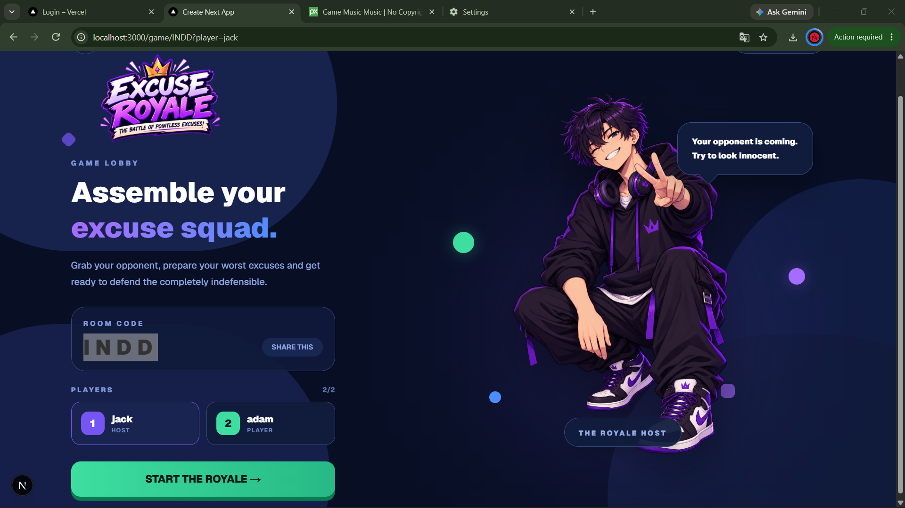
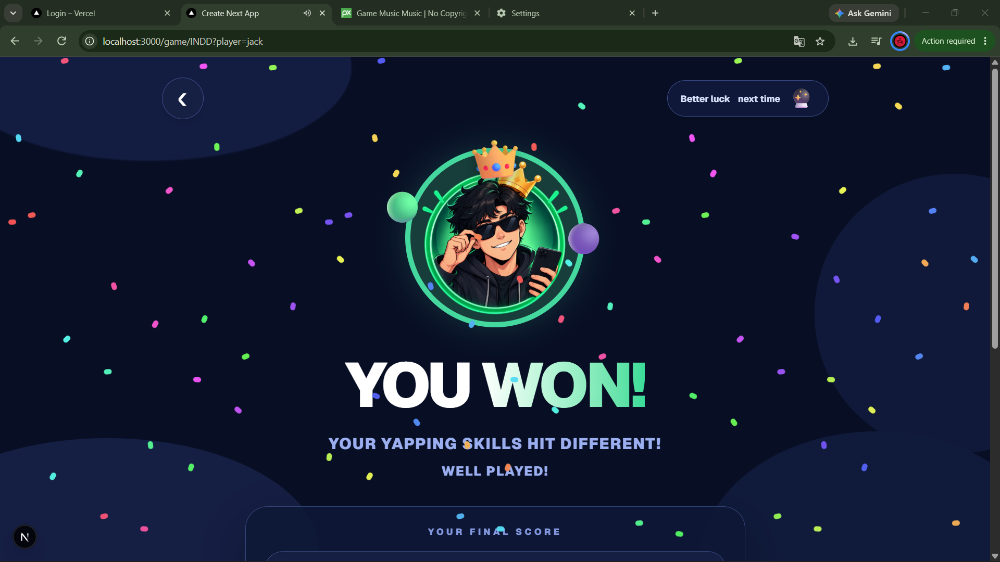

# Excuse Game 🎯

## Basic Details
### Team Name: COHERENCE

### Team Members
- Team Lead: **ABHISHEK-C** - GEC THRISSUR
- Member 2: **GOUTHAM RAJEEVAN** - GEC THRISSUR

### Project Description
**Excuse Game**, also known as **Excuse Royale**, is a two-player competitive game where an AI generates random and ridiculous situations, and players compete to create the most unnecessarily elaborate excuse.

After a series of rounds, the player with the highest score wins. The goal is not to make a good excuse, but to create the most creative, detailed, and pointless one possible.

### The Problem (that doesn't exist)
People are constantly running out of believable excuses for situations that absolutely do not need an explanation.

We identified this completely unnecessary crisis and decided that it deserved its own competitive multiplayer game.

### The Solution (that nobody asked for)
Excuse Royale gives two players random situations and challenges them to invent increasingly ridiculous excuses.

The longer, stranger, more creative, and more unnecessarily detailed the excuse, the better the chance of earning points. After multiple rounds, the player with the highest score becomes the ultimate excuse champion.

## Technical Details

### Technologies/Components Used

For Software:
- **Languages:** TypeScript, HTML, CSS
- **Frameworks:** Next.js, React
- **Database / Backend:** Supabase
- **AI:** AI-generated scenarios and game content
- **Tools:** VS Code, Git, GitHub, Vercel

For Hardware:
- No dedicated hardware required
- Works on a computer, laptop, or smartphone with a modern web browser

### Implementation

For Software:

# Installation

Clone the repository:

```bash
git clone <repository-url>
cd <repository-folder>
```

Install the project dependencies:

```bash
npm install
```

Create a `.env.local` file and add the required Supabase and AI environment variables.

# Run

Start the development server:

```bash
npm run dev
```

Then open:

```text
http://localhost:3000
```

## Project Documentation

For Software:

# Screenshots


*Landing page where players enter their nickname and choose whether to create or join a room.*


*Two-player game lobby showing the room code and players before starting the Excuse Royale.*


*End-of-game screen announcing the winner and displaying the final result.*

# Diagrams


*Game workflow: players enter a session, receive an AI-generated scenario, submit excuses, receive scores, and continue through rounds until a winner is determined.*

## Project Demo

# Video
https://drive.google.com/file/d/13J2YeDwNGwJZfhw_eRfxskoV8tDlhQrr/view?usp=drive_link
*The demo demonstrates the complete game flow, including room creation/joining, gameplay, excuse submission, scoring, and the final winner screen.*


## Team Contributions

- **ABHISHEK-C:** Project concept, UI/UX design, frontend development, landing page, game flow and integration.
- **GOUTHAM RAJEEVAN:** Multiplayer/session functionality, backend integration, game logic, AI integration, testing and deployment.

---

Made with ❤️ at TinkerHub Useless Projects


